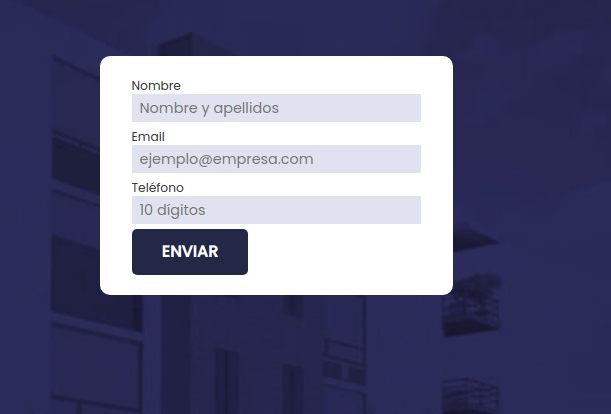
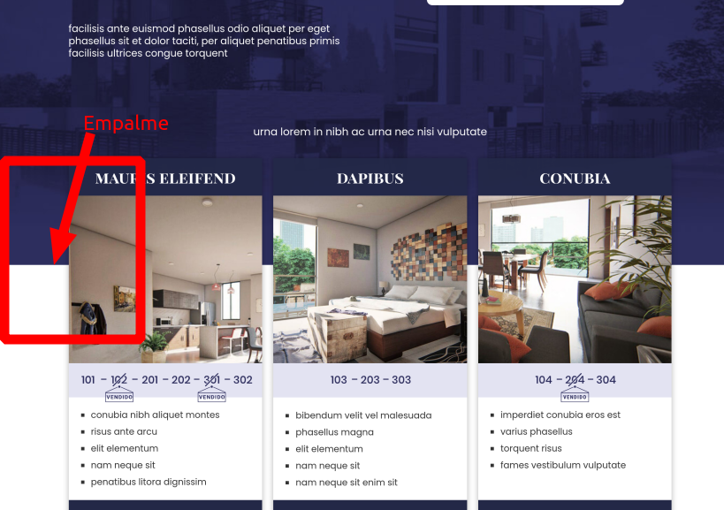

Tasky
===

### Tasks

#### 1. Front-end

**Task: Crear un formulario en React con nombre, email y teléfono; guardar en base de datos la información enviada.**

- Debe validar:
  - Que el usuario escriba su nombre con apellidos
  - Que el email sea válido
  - Que el teléfono sea a 10 dígitos
- Al enviar, debe guardar la información en base de datos



Puntos extra si la validación de nombre y apellidos se hace correctamente incluso si el usuario pone espacios o caracteres especiales, y si el teléfono es validado a 10 dígitos, independientemente de guiones y espacios que introduzca el usuario.

Puntos extra (×2) si el formulario (y sus campos y botón) se deshabilita para evitar que se envíe la información dos veces.

**Task: Completar la maqueta.**

Lograr que la primer sección (de fondo azul) se empalme ligeramente con la segunda sección:



Revisar [diseño final](tasky/landing.png) como referencia de cómo debe verse la maqueta.

Puntos extra si la implementación considera un diseño responsive y los bordes de la imagen de fondo no son visibles en diferentes resoluciones.

#### 2. Back-end

**Task: Crear modelo Lead.**

Crea un nuevo modelo llamado `Lead` y una nueva migración que agregue al modelo 3 columnas string: nombre, email, teléfono.

**Task: Crear nuevo controlador.**

Crea un nuevo controlador para recibir la información del formulario y la guarde al modelo `Lead`.

Puntos extra si se realiza la misma validación que se hace en front-end, pero a través del controlador.

**Task: Nuevo endpoint.**

Crea un endpoint con ruta `/api/lead` y método POST para el controlador creado anteriormente, donde recibirás la información del formulario.

#### 3. Tests

**Task: Completa las pruebas unitarias.**

Completa la prueba unitaria `test/Feature/LeadsTest` para comprobar que el endpoint recibe la información de Lead y la persiste en la base de datos.

**Task: Completa la prueba de integración.**

Completa la prueba de integración `test/Browser/LeadsTest` para comprobar que un usuario al escribir su información en el formulario y enviarlo el sistema recibe y persiste su información en la base de datos.

Puntos extra si la prueba se asegura que al enviar el formulario se muestre un mensaje de confirmación.

---

**Para correr pruebas unitarias:**

```
php artisan test
```

**Para correr pruebas de integración:**

```
php artisan dusk
```

---

### Setup

#### 1. Clonar repo

```
git clone git@github.com:osom-so/tasky.git
```

#### 2. Instalar dependencias

```
composer install
```
```
npm i
```
```
php artisan dusk:install
```

#### 3. Preparar Laravel

```
cp .env.example .env
```
```
php artisan key:generate
```

### Levantar servers

```
php artisan serve
```
```
npm run hot
```
